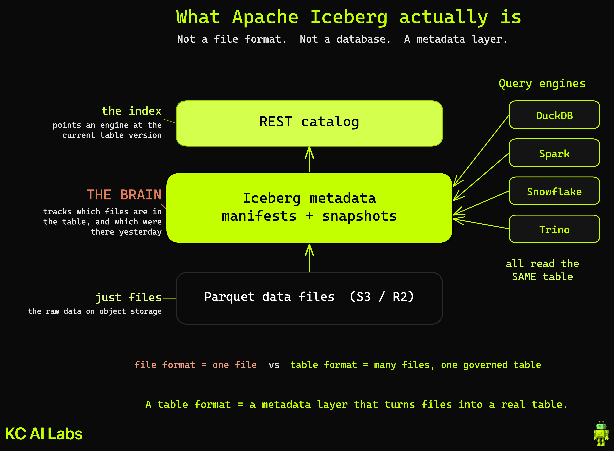
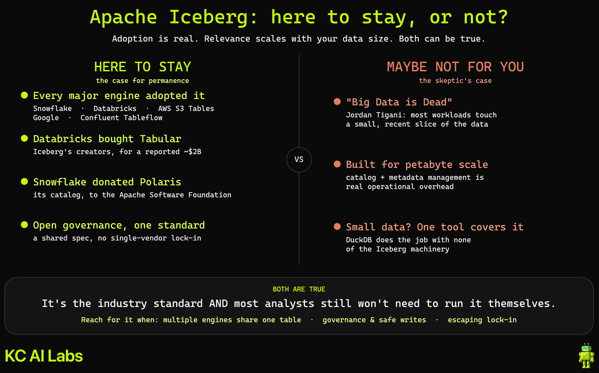
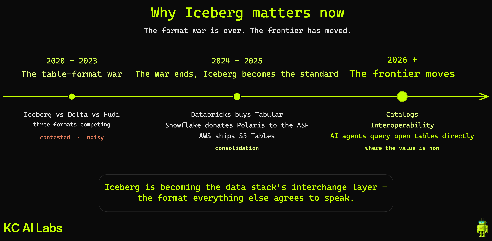

# Apache Iceberg, Explained

Concept diagrams from the "Apache Iceberg Explained" video on the [Kyle Chalmers Data & AI channel](https://youtube.com/@kylechalmersdataai). The video covers what Apache Iceberg actually is, why its mechanics matter even if you never run it, and whether it is here to stay.

## Diagrams

### What Apache Iceberg actually is
A table format is a metadata layer that turns a pile of Parquet files in object storage into one real, queryable table. Not a file format, and not a database.

### Here to stay, or not?
The honest debate. On one side, near-universal engine adoption (Snowflake, Databricks, AWS, Google, Confluent) and open governance. On the other, the "Big Data is Dead" case that most workloads never hit the scale Iceberg was built for.

### Why it matters now
The table-format war is over. The frontier moved to catalogs, interoperability, and AI agents querying open tables. Iceberg is becoming the interchange layer of the data stack.

## Sources
- Apache Iceberg: https://iceberg.apache.org/
- PyIceberg: https://py.iceberg.apache.org/
- AWS S3 Tables: https://aws.amazon.com/s3/features/tables/
- Apache Polaris: https://polaris.apache.org/
- "Big Data is Dead", Jordan Tigani (MotherDuck): https://motherduck.com/videos/the-death-of-big-data-and-why-its-time-to-think-small-jordan-tigani-ceo-motherduck/

The `.excalidraw` source files are included so you can open and adapt them in [Excalidraw](https://excalidraw.com/).
