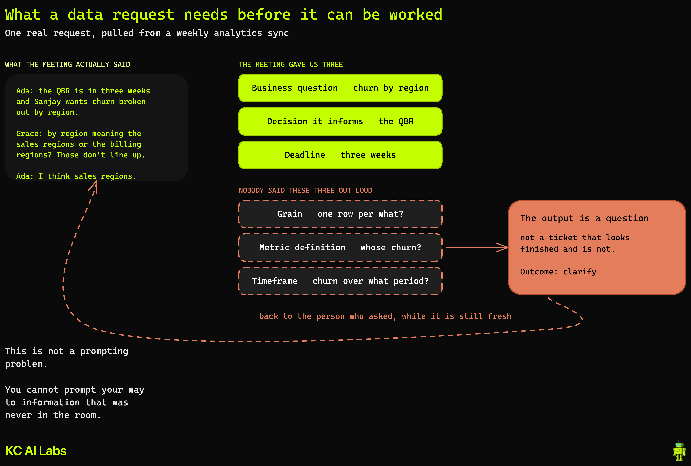

# Meeting Transcript to Jira Tickets

> **YouTube:** Turn Any Meeting Transcript Into Scoped Jira Tickets with Claude Code — [Kyle Chalmers Data & AI](https://youtube.com/@kylechalmersdataai)

Turning a meeting into work that actually gets followed up and finished, using Claude Code, the
Atlassian connector, and Atlassian's own meeting-notes skill — with a review gate in front of the
board.

Follows on from [Claude Code vs Manual Jira Ticket Work](https://youtu.be/WRvgMzYaIVo).

---

## The problem

Analytics work gets decided in conversations. Whether any of it happens depends on whether someone
remembered to write it down properly afterwards. Microsoft's Work Trend Index found that
[57% of meetings are ad hoc calls with no calendar invite](https://www.microsoft.com/en-us/worklab/work-trend-index/breaking-down-infinite-workday)
— no agenda, no doc, no artifact. For a lot of meetings, the transcript is the only record they
happened.

Extracting action items from that transcript is the easy part, and Atlassian already ships a skill
that does it. The harder part is deciding which of them should become a ticket at all, and whether
the ones that should are specified well enough to actually get worked.

---

## Setup

**1. Connect Atlassian.** In Claude Code: Customize in the left sidebar → Connectors → **+** →
Browse → Atlassian → Connect. OAuth 2.1, and it respects the Jira permissions your account already
has.

If you would rather wire it up by hand, the current endpoint is:

```bash
claude mcp add --transport http atlassian https://mcp.atlassian.com/v1/mcp/authv2
```

> The older `--transport sse … /v1/sse` endpoint has moved. See
> [ATLASSIAN_MCP_SETUP.md](../integrating_jira_and_ticket_taking/ATLASSIAN_MCP_SETUP.md) for the
> full setup guide.

The [Atlassian Rovo MCP Server](https://www.atlassian.com/platform/remote-mcp-server) is free on
every Jira Cloud plan, including Free. Cloud only — it does not support Data Center or Server.

**2. Install Atlassian's official plugin.**

```bash
claude plugin install atlassian@claude-plugins-official
```

This registers five skills, including `capture-tasks-from-meeting-notes`, which extracts action
items from notes and creates Jira tasks. Source:
[atlassian/atlassian-mcp-server](https://github.com/atlassian/atlassian-mcp-server).

**3. Get a transcript.** Any text transcript works — see
[TRANSCRIPT_SOURCES.md](TRANSCRIPT_SOURCES.md) for how to export one from whatever your team
records with.

---

## The workflow

Work in [`demo/`](demo/). It contains a sample transcript and the three prompts, in order.

**Want a real transcript rather than the sample?** [`demo/meeting-script.md`](demo/meeting-script.md)
is a two-person meeting written to be performed in Zoom, so you can generate a genuine transcript
with real speaker labels. You do not need a second person: join from two devices under different
display names, since Zoom labels the transcript by participant rather than by voice. Two labeled
speakers is the minimum — a single-speaker transcript collapses the "who committed" question and
the assignee lookup along with it.

| Step | Prompt | What it does |
|---|---|---|
| 1 | [`01-extract-candidates.md`](demo/prompts/01-extract-candidates.md) | Reads the transcript, judges every candidate, writes nothing |
| 2 | [`02-clarify.md`](demo/prompts/02-clarify.md) | Drafts questions back to requesters for items missing fields |
| 3 | [`03-draft-and-ship.md`](demo/prompts/03-draft-and-ship.md) | Drafts the tickets, stops, creates them on approval |

[TICKET_TEMPLATE.md](TICKET_TEMPLATE.md) is what steps 1 and 3 work against: the five-test gate that
routes a candidate to one of the four outcomes, and the description skeleton an `accept` gets filled
into.

Atlassian's `capture-tasks-from-meeting-notes` skill covers the extraction on its own and is a
reasonable place to start. These prompts add the layer it does not: deciding what should not be
filed, and catching what a request is missing before it lands on the board.

---

## The intake rule

**File commitments, not ideas.** A named person has to have committed to doing the thing. Applying
that loosely produces a longer backlog, not more finished work.

Every candidate resolves to one of four outcomes — **accept**, **clarify**, **decline**, or
**recurring** — a framing taken from Brooklyn Data's
[data intake process](https://www.brooklyndata.co/ideas/2024/12/18/how-to-design-an-effective-data-intake-process).
A single extraction pass can only ever produce `accept`. The judgment lives in the other three.

## What a data ticket needs that a task does not

Business question, the decision it informs, grain (one row per what), metric definition, timeframe,
deadline.



Taking one real request from the sample transcript: the meeting supplied three of the six fields and
never mentioned the other three. Grain and metric definition are almost never said out loud. That is
not a prompting problem — the information is not in the input. When they are missing, the correct
output is a question back to the requester, which is what step 2 drafts. The centre of Caitlin Hudon's
[intake form for data requests](https://www.caitlinhudon.com/posts/2020/09/16/data-intake-form) is
still the best single question to ask: *what decision will you make, or what action will you take,
with this data?*

## Why a human approves before anything is written

Two reasons, and neither is only caution.

The agent is processing untrusted input (a transcript) and changing state in a system of record
(Jira). Under the [Agents Rule of Two](https://simonwillison.net/2025/Nov/2/new-prompt-injection-papers/),
that combination wants supervision rather than autonomy. The review step is the third leg
deliberately removed.

And the input itself has a measurable error floor. A peer-reviewed study at ACM FAccT 2024
([Careless Whisper](https://arxiv.org/abs/2402.08021)) found roughly 1% of transcriptions contained
entirely fabricated sentences, clustering around pauses and background noise — which is most of the
acoustic profile of a group call. A fabricated sentence becoming a filed ticket with someone's name
on it is a real failure mode.

---

## Related

- [Claude Code vs Manual Jira Ticket Work](https://youtu.be/WRvgMzYaIVo) — connecting Claude Code to Jira
- [Atlassian CLI vs MCP comparison](../integrating_jira_and_ticket_taking/README.md)
