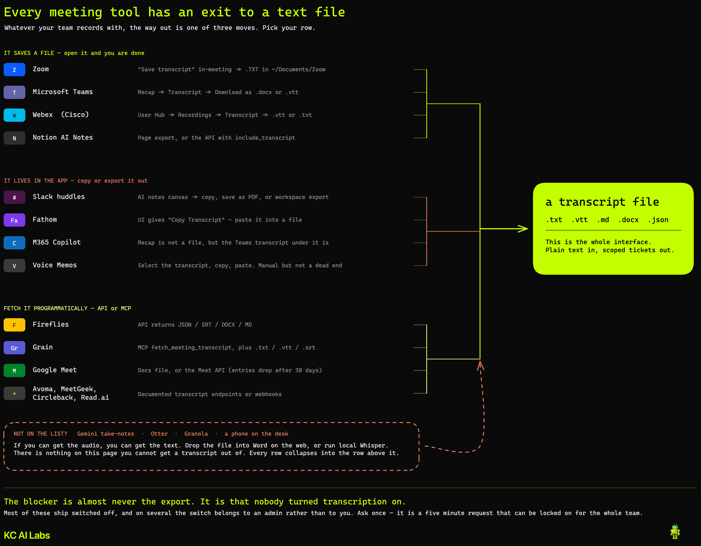

# Getting a transcript out of your meeting tool

The input to this workflow is a plain text file. That is the whole interface, so it does not much
matter what your team records with — only whether you can get the text onto disk.

Rows re-verified against vendor documentation on **2026-07-30**. This space changes quickly, and plan
and admin details in particular go stale fast — check the vendor's own docs before relying on one.

## Read this first: it is probably just switched off

The most common reason you cannot find a transcript is not that your tool lacks the feature. It is
that nobody enabled it, or that you are not the person allowed to download it.

| Tool | Who has to turn it on |
|---|---|
| **Zoom** | You can, in your own settings. An admin can also lock it on account-wide |
| **Microsoft Teams** | On by default in the global meeting policy; admins can restrict it via `AllowTranscription`. Separately, only the organizer and co-organizers can **download** by default |
| **Google Meet** | On by default for most eligible editions, and a host or co-host can start it. An admin can restrict it |
| **Webex** | An admin controls whether in-meeting transcript download is allowed |
| **Slack** | **You can.** Any member starts AI notes in a huddle, or sets a channel to start them automatically |
| **Notion AI Meeting Notes** | Workspace owner. Business or Enterprise plan |
| **Granola** | Export on by default for Basic and Business; **disabled by default on Enterprise** |
| **Read.ai** | One admin toggle disables exports and the API together |
| **Avoma** | Admin creates API keys and publishes the MCP connector |
| **Otter** | Organization-wide consent uses Otter's own admin link, though tenant policy may permit user consent |

The practical move is to ask once. It is a five minute request, these settings can usually be locked
on for the whole team, and it unblocks everything downstream.

**A second gate if your tool uses a bot.** Teams now forces detected notetaker bots into the lobby
by default (`ExternalBotAccessMode` = `RequireApprovalWhenDetected`), and Google Meet auto-denies
them outright under Restricted access. A notetaker that worked last year may quietly stop appearing.
Tools that capture system audio instead (Notion, Granola, Supernormal) have nothing to block — the
trade is that nothing appears in the participant list either, so tell people.

---

## Tier 1 — a readable file, no API work

| Tool | Format | How you get it | Plan | Admin gate | Bot joins? |
|---|---|---|---|---|---|
| **Notion AI Meeting Notes** | Markdown via page export or API | API: `GET /v1/pages/{id}/markdown?include_transcript=true` | Business or Enterprise | Workspace owner controls it | **No** — captures system audio |
| **Zoom meeting transcript** | `.TXT` | "Save transcript" in-meeting → `~/Documents/Zoom` | Paid plan; confirm yours | **Yes, off by default** | No |
| **Microsoft Teams** | `.docx` or `.vtt` | Chat → past meeting → Recap → Transcript → Download | Core Teams capability, not Premium-only | Organizer controls who can download | No |
| **Webex**  (Cisco) | `.vtt` or `.txt` | User Hub → Recordings → Transcript → Download. Also downloadable in-meeting from the captions panel | Webex Suite meeting platform | Admin allows in-meeting download | No |

> **Zoom: two different features, easy to confuse.** *Meeting transcript* is the one that saves a
> retained `.TXT`. *Captions* are live-only — Zoom removed post-meeting caption saving in May 2026. If
> a guide tells you to save your captions after the call, it is out of date. Turn on Meeting
> transcript instead.

## Tier 2 — clean, but API-mediated

| Tool | Format | Notes |
|---|---|---|
| **Google Meet** | Google Doc; API returns plain text | `conferenceRecords.transcripts.entries`. **Entries are deleted 30 days after the conference.** The Docs file follows Drive/Vault retention instead. Drive-for-desktop syncs Docs as pointer stubs, so a local agent cannot read a synced file directly |
| **Fireflies** | JSON, PDF, DOCX, SRT, CSV, MD | Bearer-token API. **Check your own plan before relying on this** — Fireflies' pricing page lists API access from Pro, while their API guide implies broader access. Test it on the account you actually have |
| **Grain** | `.md`, and API gives `.txt` / `.vtt` / `.srt` / JSON | MCP `fetch_meeting_transcript` works on **all plans including Free**. REST API access from Starter up |
| **Granola** | MCP | The CSV export holds titles, summaries and details — **not** full transcripts. Transcript access is through MCP, on paid plans. **No bot** — captures system audio |
| **Zoom cloud recording** | `.vtt` only | `GET /meetings/{id}/recordings`, then the `TRANSCRIPT` file. Bearer header, not a query param |
| **Fathom, MeetGeek, Avoma, Circleback** | JSON via API or webhook | All have documented transcript endpoints or transcript-bearing webhooks |

## Tier 3 — the text exists, but you lift it out by hand

None of these is a true dead end. There is no download button, so you copy, print, or go one layer
down to the artifact underneath.

| Tool | Why |
|---|---|
| **M365 Copilot recap** | The recap itself is not a file, but the Teams transcript underneath it is downloadable — go there instead |
| **Gemini "Take notes for me"** | Notes land in a Google Doc. The Meet API exposes `smartNotes` pointing at that Doc, so retrieval runs through Docs/Drive |
| **Slack huddle AI notes** | The transcript sits in the notes canvas and is excluded from search, so you will not find it by searching. Copy it, print to PDF, or pull it from a workspace export |
| **Fathom (UI)** | Unlimited free recording and a good API, but the UI offers only "Copy Transcript" |
| **Read.ai** | OAuth 2.1 with no static keys and 10-minute tokens. One admin toggle kills exports and the API together |
| **Apple Notes / Voice Memos** | Select the transcript, copy, paste into a file. Manual, but not a dead end. Microphone-based, so they capture the room rather than the far end of a call |

---

## If your tool gives you audio but no text

Upload the audio file to **Word on the web** (Transcribe, on a Microsoft 365 subscription — check the
current monthly allowance, it has changed before) and save the result, or run it through local
Whisper. This covers Zoom computer recordings, which produce MP4, M4A and a chat log but no
transcript file.

This is the reason nothing on this page is a true dead end: audio always collapses back to text.

---

## Two things that changed in 2026

**Bot-based capture is degrading on Google Meet.** Google's documentation now states that
third-party bots attempting to join under Restricted access "are automatically denied access
without actions required by the host." Several notetakers have shipped bot-free desktop capture in
response — check whether yours has.

**Consent controls are appearing.** Google offers an admin setting requiring explicit participant
consent before note-taking; it is off by default. Webex announces to participants when transcription
starts. For an unattended agent, either one can be a silent failure, so test before you rely on it.

Worth saying plainly: tools that capture system audio without a bot (Notion, Granola, Supernormal)
put no notetaker in the participant list. The conferencing platforms show their own recording
indicator, but if you are capturing system audio, tell people.
